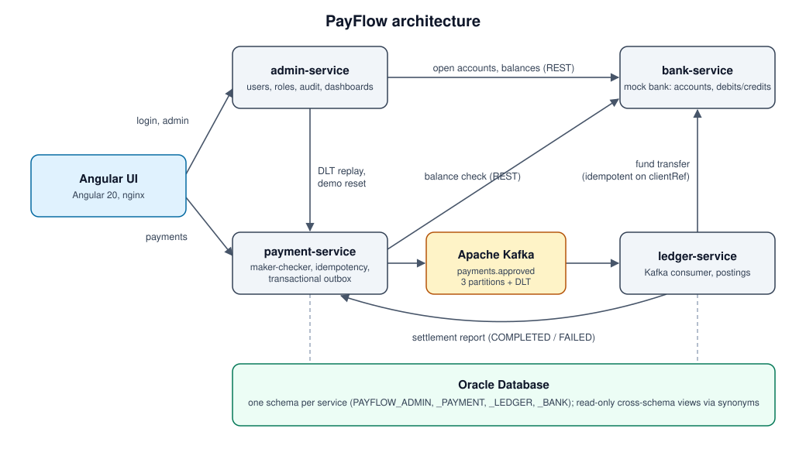
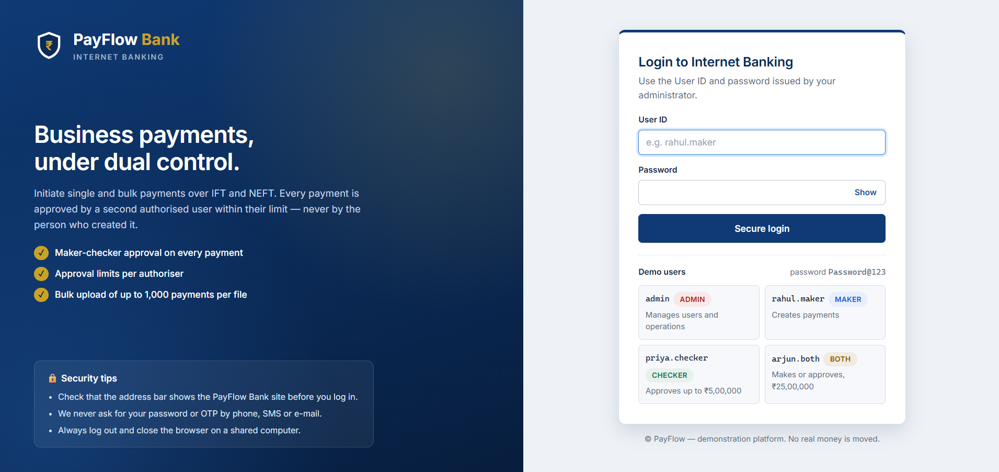
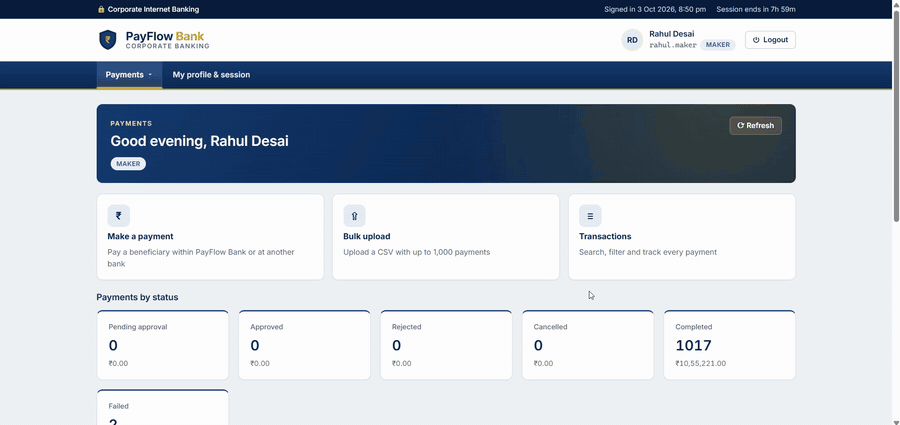

# PayFlow: Corporate Payments Platform

**A corporate payments platform built to explore distributed-systems and concurrency problems. It moves no real money.**

Four Spring Boot microservices and an Angular front end model a simplified corporate banking flow. One user creates a payment, a different user approves it, and a mock bank posts the debit and credit over the IFT or NEFT rails. The services run on Oracle Database and Apache Kafka.

> **Source code is private.** This repository is a showcase of the design and the running app. A code walkthrough is available on request.

<!-- Live demo: add the link here once deployed -->

## Key features

- **Maker-checker authorization.** Every payment, single or bulk, must be approved by a different user within their approval limit. A database `CHECK` constraint enforces maker ≠ checker as well, so application code can't bypass it.
- **Transactional outbox.** Approving a payment writes the status change and the Kafka event in one database transaction. A publisher then relays the event, so a crash can never lose a payment between the database and Kafka.
- **Idempotency at every hop.** An `Idempotency-Key` header makes "Submit" safe to repeat. The ledger is idempotent on the payment ID and the bank on the client reference. Duplicate delivery can't debit an account twice.
- **Kafka only where it earns its place.** There's one asynchronous handoff (payment → ledger), over 3 partitions with retry, backoff and a dead-letter topic. Admins can replay dead letters from the UI. Everything else is plain REST.
- **Concurrency-safe posting.** The bank locks account rows in a fixed order (no deadlocks), re-checks for duplicates under the lock, and is backed by database constraints such as "balance never negative".
- **Bulk payments.** Upload a CSV of up to 1,000 payments. It's validated all-or-nothing, with every line error reported at once, and approved as one batch against the batch total.
- **One writer per table.** Each service owns its own Oracle schema. Cross-service dashboards read through read-only synonyms instead of extra events.
- **Signed session tickets.** Login issues an HMAC-SHA256 ticket that every service verifies. Role, limit and status are re-checked on every write, so a disabled user loses access immediately.

## Services

| Service | Responsibility |
|---|---|
| **admin-service** | Users and roles, audit log, login, account opening, live dashboards, dead-letter replay, demo reset |
| **payment-service** | Single and bulk payments, maker-checker approval, outbox publisher to Kafka |
| **ledger-service** | Consumes approved payments, posts them at the bank, reports the outcome |
| **bank-service** | Mock bank: sole owner of accounts, balances, transfers and statement entries |
| **PayFlow UI** | Angular app for makers, checkers and admins |

## How a payment flows

1. A **maker** creates a payment (or uploads a bulk file). It waits in *Pending approval*.
2. A **checker** approves it. One transaction updates the payment and writes an outbox event.
3. The outbox publisher sends the event to Kafka.
4. **ledger-service** consumes it and asks **bank-service** to move the money.
5. The ledger reports back, and the payment becomes *Completed*, with a bank reference, or *Failed*, with the bank's reason.

<!-- Screenshots: uncomment once the images are in screenshots/
## Screenshots

| | |
|---|---|
|  |  |
| Sign in with demo quick-login | Make a payment |
|  |  |
| Checker's pending approvals | Payment completed with bank reference |
|  | |
| Admin dashboard | |

### Demo: maker creates, checker approves, payment completes

-->

## Tech stack

| Layer | Technology |
|---|---|
| Backend | Java 17, Spring Boot 3.3, Spring Security, Spring Data JPA, Spring Kafka, Flyway |
| Messaging | Apache Kafka 3.9 (idempotent producer, `acks=all`, dead-letter topic) |
| Database | Oracle Database 23ai Free (one schema per service) |
| Frontend | Angular 20, TypeScript |
| Testing | JUnit 5, Mockito, Testcontainers, Spring MockMvc |
| Deployment | Docker Compose, nginx, Oracle Cloud Always Free |

## Scope

PayFlow is a portfolio project, not a production system. The bank is simulated, Kafka runs as a single node, and authentication covers only what the demo needs. Multi-threaded bulk processing with Spring Batch is in progress.
